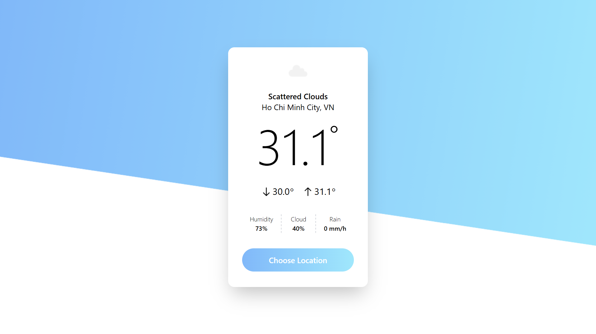

# 🌤️ BinWeatherApp
- Weblink: https://bin-weather-app-zeta.vercel.app
- A simple and modern weather forecast application and powered by a public weather API. This app provides real-time weather information based on user input.

## ✨ Technologies
- **Frontend:** Next.js 14, Tailwind CSS
- **API:** OpenWeatherMap (or other weather API)
- **Styling:** Tailwind CSS utility-first approach

## 🚀 Feature & Learning
- 🔍 Search for current weather by city name
- 🌡️ Display temperature, humidity, and weather conditions
- 📱 Responsive design for all screen sizes
- ⚡ Fast loading and smooth UI

## 🚦 Running the Project
1. Clone the repository
2. Install dependencies: npm install
3. Run development server: npm run dev
4. Open http://localhost:3000 in your browser

## 🎞️ Preview

